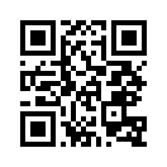
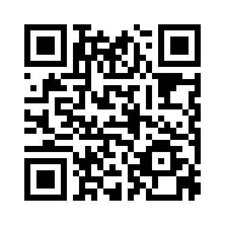

# 🔐 QR Phishing Detection Using Machine Learning


## 📌 Overview

QR codes have become a common way to access websites, make payments, and share information. However, attackers increasingly use malicious QR codes to redirect users to phishing websites.

This project presents a **Machine Learning-based QR Phishing Detection System** that analyzes URLs extracted from QR codes and classifies them as **Safe** or **Phishing** using feature extraction and predictive modeling.

---

## 🎯 Objectives

- Detect phishing URLs hidden inside QR codes.
- Extract meaningful URL-based features.
- Train a Machine Learning model for classification.
- Provide users with instant phishing detection results.
- Improve awareness and protection against QR-based cyber attacks.

---

## 🛠️ Technologies Used

| Technology | Purpose |
|------------|----------|
| Python | Development |
| Pandas | Data Processing |
| NumPy | Numerical Computation |
| Scikit-Learn | Machine Learning |
| OpenCV | QR Code Processing |
| QRCode Library | QR Generation |
| Joblib/Pickle | Model Serialization |

---

## 📂 Project Structure

```text
QR-Phishing-Detection/
│
├── app.py
├── main.py
├── model.py
├── feature_extraction.py
├── generate_qr.py
├── flowchart.py
│
├── dataset.csv
├── model.pkl
│
├── phishing_qr.png
├── safe_qr.png
├── test_qr.png
│
├── README.md
├── requirements.txt
└── LICENSE
```

---

## ⚙️ System Architecture

```text
             ┌─────────────┐
             │ QR Code     │
             │ Input Image │
             └──────┬──────┘
                    │
                    ▼
         ┌──────────────────┐
         │ URL Extraction   │
         └────────┬─────────┘
                  │
                  ▼
      ┌────────────────────────┐
      │ Feature Extraction     │
      │ (URL Characteristics)  │
      └──────────┬─────────────┘
                 │
                 ▼
      ┌────────────────────────┐
      │ Trained ML Model       │
      └──────────┬─────────────┘
                 │
                 ▼
      ┌────────────────────────┐
      │ Safe / Phishing Result │
      └────────────────────────┘
```

---

## 🔄 Workflow

1. Scan or load a QR code image.
2. Extract the embedded URL.
3. Generate URL-based security features.
4. Load the trained Machine Learning model.
5. Predict whether the URL is:
   - ✅ Safe
   - 🚨 Phishing
6. Display the result to the user.

---

## 🚀 Installation

### Clone Repository

```bash
git clone https://github.com/AnimeshDaiman7/QR-Phishing-Detection.git
cd QR-Phishing-Detection
```

### Install Dependencies

```bash
pip install -r requirements.txt
```

---

## ▶️ Running the Project

```bash
python app.py
```

or

```bash
python main.py
```

---

## 📊 Machine Learning Pipeline

### Data Collection
- Phishing URLs
- Legitimate URLs

### Feature Engineering
Examples:

- URL Length
- Number of Dots
- Number of Hyphens
- Presence of IP Address
- HTTPS Usage
- Special Character Count

### Model Training

The extracted features are used to train a machine learning classifier capable of distinguishing between legitimate and phishing URLs.

---

## 📸 Screenshots

### Safe QR Detection



---

### Phishing QR Detection



---

### Testing QR Code


---

## 📈 Future Enhancements

- Deep Learning-Based Detection
- Real-Time Camera Scanning
- Browser Extension Integration
- Mobile Application Deployment
- Cloud-Based Threat Intelligence

---

## 🔒 Security Applications

This project can be used in:

- Cybersecurity Awareness Programs
- Secure Payment Systems
- Enterprise Security Solutions
- Educational Research Projects
- Anti-Phishing Tools

---

## 👨‍💻 Author

**Animesh Daiman**

GitHub: https://github.com/AnimeshDaiman7

---

## 📜 License

This project is licensed under the MIT License.

---

## ⭐ Support

If you found this project useful, consider giving it a ⭐ on GitHub.
